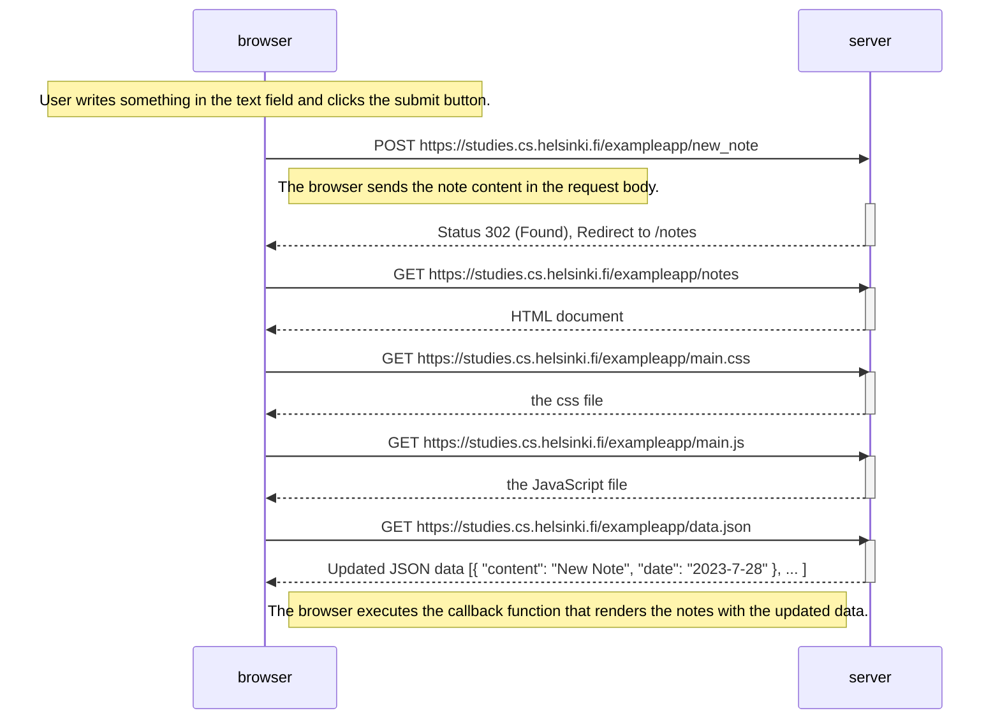
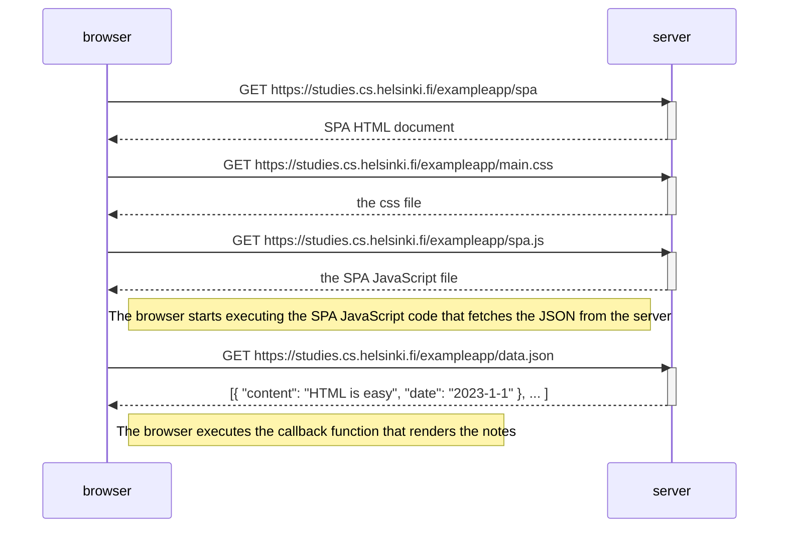
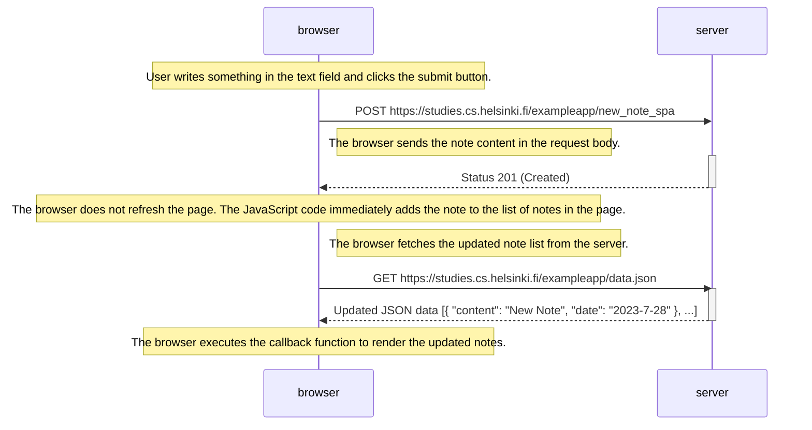

# New note diagram
The diagram deplict the series of events that occur when a new note is added to the notes page.

## Traditional method to add a new note

## SPA method of fetching notes

## SPA method to add note to the notes page

