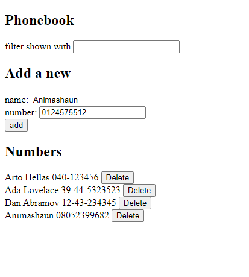

# Phonebook Backend 📖

A robust backend serving a frontend React application, offering an API for managing a simple phonebook.

## 📗 Table of Contents

- [📖 Overview](#overview)
  - [🎯 Project Objectives](#project-objectives)
  - [🛠 Built With](#built-with)
    - [Tech Stack](#tech-stack)
    - [🔑 Key Features](#key-features)
  - [🚀 Live Demo](#live-demo)
    - [Screenshots](#screenshots)
- [💻 Getting Started](#getting-started)
  - [Setup](#setup)
  - [Prerequisites](#prerequisites)
  - [Install](#install)
  - [🧪 Run Tests](#run-tests)
  - [🚀 Deployment](#deployment)
- [🛡️ API Endpoints](#api-endpoints)
  - [API Testing](#api-testing)
- [🔧 Development Mode](#development-mode)
- [👥 Authors](#authors)
- [🔭 Future Features](#future-features)
- [🤝 Contributing](#contributing)
- [⭐️ Show Your Support](#support)
- [🙏 Appreciation](#appreciation)
- [📝 License](#license)

## 📖 Overview

Phonebook Backend is a robust backend serving a frontend React application, designed to manage a simple phonebook.

### 🎯 Project Objectives

- Provide an API for CRUD operations.
- Offer seamless integration with a frontend React application.
- Ensure data persistence and error handling.

### 🛠 Built With

This project leverages the following technologies:

#### Tech Stack

- Node.js
- Express.js

#### 🔑 Key Features

- CRUD operations for phonebook entries.
- Integration with a React frontend.
- Error handling and data validation.

### 🚀 Live Demo

The live demo of the application can be accessed [here](https://phonebook-backend-xscy.onrender.com/).

#### Screenshots

## 💻 Getting Started

### Setup

1. Clone the repository: `git clone https://github.com/fmanimashaun/fullstackopen_submission.git`
2. Navigate to the project directory: `cd fullstackopen_submission/part3/phonebook`

### Prerequisites

- Node.js
- NPM

### Install

1. Install dependencies: `npm install`
2. Start the server: `npm start`

### 🧪 Run Tests

_TODO: to be added in the future._

### 🚀 Deployment

The backend has been deployed on [Render](https://www.render.com/) using their free tier offer. The root folder for the deployment is `part3/phonebook`.

## 🛡️ API Endpoints

- Get All Persons: [GET] /api/persons
- Add Person: [POST] /api/persons
- Update Person: [PUT] /api/persons/:id
- Delete Person: [DELETE] /api/persons/:id

### API Testing

You can test the API endpoints using the provided .rest files located in the requests/ directory:

- create_person.rest
- delete_person.rest
- get_all_persons.rest

Use a tool like `REST Client` for Visual Studio Code.

## 🔧 Development Mode

For development, this project uses Nodemon to automatically refresh and apply changes without needing to restart the server manually.

1. To start in development mode, run: `npm run dev`

## 👥 Authors

👤 **Engr. Animashaun Fisayo**

- [GitHub](https://github.com/fmanimashaun)
- [Twitter](https://twitter.com/fmanimashaun)
- [LinkedIn](https://www.linkedin.com/in/fmanimashaun/)
- [Website](https://fmanimashaun.com)

## 🔭 Future Features

- integration with database for data persistence.

## 🤝 Contributing

Contributions, issues, and feature requests are welcome! Feel free to check the [issues page](../../issues/).

## ⭐️ Show Your Support

Give a ⭐️ if you like this project!

## 🙏 Appreciation

Special thanks to the University of Helsinki for their invaluable resources and support throughout the development of this project.

## 📝 License

This project is [MIT](./LICENSE) licensed.
